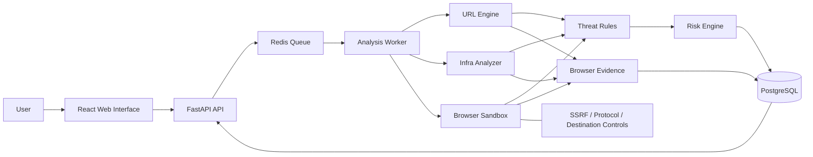

# OCULIS

---

## Why OCULIS?

A suspicious link creates a simple security problem:

**You need to inspect it, but inspecting it yourself may be the dangerous part.**

Opening an unknown URL directly can expose a browser, credentials, cookies, devices, and users to malicious content.

OCULIS changes that workflow.

Instead of:

```text
Unknown URL
     ↓
User opens it
     ↓
Browser contacts destination
     ↓
Risk is discovered too late

```

OCULIS follows:

```text
Unknown URL
     ↓
OCULIS receives the URL
     ↓
Safety checks + SSRF protection
     ↓
Remote isolated inspection
     ↓
DNS / TLS / HTTP / redirects
     ↓
Sandboxed browser rendering
     ↓
DOM + forms + scripts + network activity
     ↓
Evidence + risk analysis
     ↓
User sees the result

```

The user doesn't have to make the first risky visit themselves.

---

## The Core Idea

### Inspect first. Expose yourself later — or don't.

OCULIS is built around a distinctive user experience:

> **Enter a URL and see the remote-rendered evidence of what that destination was going to serve or load before you navigate to it yourself.**

The platform can surface artifacts such as:

* Rendered page screenshots
* Redirect chains
* HTTP response metadata
* Security headers
* DNS resolution
* TLS certificate basics
* Forms and password fields
* External scripts
* Iframes
* Observed network requests
* Blocked requests
* Suspicious URL structures
* Lookalike / homoglyph indicators
* Evidence-backed security findings
* Explainable risk score and verdict

Rather than reducing everything to a black-box **"Safe / Dangerous"** label, OCULIS shows **why** a destination received a particular assessment.

---

## What Makes OCULIS Different?

Most URL scanners answer a question like:

> "Is this URL malicious?"

OCULIS is designed to answer a richer question:

> **"What happens when this URL is inspected, what does it attempt to expose or load, and what evidence suggests that I should or should not trust it?"**

That difference matters.

A URL can use HTTPS and still be suspicious.

A domain can contain a legitimate brand name and still be a lookalike.

A page can look harmless while loading external scripts or requesting suspicious resources.

OCULIS therefore treats a verdict as an **explainable conclusion derived from multiple observable signals**, not as an unexplained binary decision.

---

## Key Capabilities

### Remote URL Inspection

Submit a URL without directly opening the target in your normal browsing session.

OCULIS performs the inspection on its own infrastructure and returns the collected evidence.

### SSRF-Aware Fetching

The analysis pipeline validates destinations before network access and re-validates destinations across redirects.

The intent is to prevent user-controlled URLs from being used to reach:

```text
127.0.0.1
localhost
private networks
link-local addresses
metadata endpoints
other restricted destinations

```

This is treated as foundational infrastructure rather than an optional feature.

### Remote Browser Rendering

OCULIS can render a destination inside a sandboxed browser environment and capture:

* screenshot
* DOM structure
* forms
* password inputs
* scripts
* iframes
* console errors
* network requests

This makes the product useful for inspecting the **actual rendered experience**, not only the raw URL string.

### Redirect Intelligence

Instead of examining only the submitted URL:

```text
A → B → C

```

OCULIS follows the chain inside its controlled analysis environment and records the path toward the final destination.

Redirects can themselves become useful evidence.

### Infrastructure Inspection

The infrastructure layer combines:

* DNS information
* TLS certificate basics
* HTTP status
* response headers
* security headers
* redirect behavior

into a unified inspection pass.

### Explainable Risk Engine

OCULIS produces a score from **0–100** and a verdict category backed by findings.

Each finding can include:

```text
Finding
Severity
Confidence
Evidence
Category
Reasoning

```

The objective is to make the score auditable by a human.

---

## What the User Actually Sees

The OCULIS experience is designed around evidence.

### Before inspection

```text
┌─────────────────────────────────────────────────────────────┐
│ TARGET URL                                                  │
│                                                             │
│   › https://suspicious-example.com/login                    │
│                                                 INSPECT URL │
└─────────────────────────────────────────────────────────────┘

```

### During inspection

```text
REMOTE INSPECTION

✓ URL validation
✓ Infrastructure analysis
✓ Redirect tracing
● Browser sandbox
○ Evidence correlation
○ Risk calculation

```

### After inspection

```text
RISK SCORE

     72 / 100

HIGH RISK

```

followed by the evidence trail:

```text
[ Redirect Chain ]

[ Browser Evidence ]

[ Network Requests ]

[ Infrastructure ]

[ Findings ]

[ Why OCULIS reached this verdict ]

```

The product is therefore not just a score generator.

It is an **evidence presentation system for suspicious URLs**.

---

## High-Value Use Cases

### Phishing Investigation

A user receives:

```text
"Your account will be suspended. Verify now."

```

Instead of clicking the link, they submit it to OCULIS.

The platform can expose:

* suspicious redirects
* credential forms
* mismatched domains
* external scripts
* unusual network activity
* infrastructure signals

before the user interacts with the destination themselves.

---

### Security Awareness

Organizations can use OCULIS as an educational demonstration tool.

A learner can submit:

```text
https://example-phishing-domain.test

```

and visually understand:

```text
URL
 ↓
Redirect
 ↓
Rendered login page
 ↓
Credential form
 ↓
External requests
 ↓
Evidence

```

This makes cybersecurity concepts much easier to understand than a simple red warning page.

---

### SOC / Analyst Triage

Security analysts frequently need to inspect URLs from:

* phishing emails
* tickets
* chat messages
* threat reports
* browser alerts
* suspicious documents

OCULIS provides a controlled first-pass inspection before deeper investigation.

---

### Incident Response

During an incident, analysts may need to determine:

> "What does this URL actually serve?"

OCULIS can provide a snapshot of observable remote behavior without requiring the analyst to manually visit the destination.

---

### Threat Research

Researchers can use the platform as an initial observation layer for:

* malicious landing pages
* redirect infrastructure
* credential harvesting pages
* suspicious domains
* phishing campaigns
* lookalike websites

---

### Security Education & Demonstrations

OCULIS is also designed to be highly visual.

Instead of telling students:

> "This page contains a suspicious form."

the interface can show the page, the captured form, the request trail, the relevant evidence, and the resulting finding.

---

## Security Architecture



The important architectural principle is:

> **User-controlled destinations never receive unrestricted network access from the analysis pipeline.**

The SSRF-safe network layer sits underneath the analysis components rather than being added after the fact.

---

## Architecture at a Glance

```text
                         ┌──────────────────┐
                         │       USER       │
                         └────────┬─────────┘
                                  │
                                  ▼
                         ┌──────────────────┐
                         │    OCULIS WEB    │
                         │ React + TypeScript│
                         └────────┬─────────┘
                                  │
                                  ▼
                         ┌──────────────────┐
                         │     FASTAPI      │
                         │       API        │
                         └────────┬─────────┘
                                  │
                                  ▼
                         ┌──────────────────┐
                         │   REDIS / RQ     │
                         │    JOB QUEUE     │
                         └────────┬─────────┘
                                  │
                         ┌────────▼─────────┐
                         │ ANALYSIS WORKER  │
                         └───┬────┬────┬────┘
                             │    │    │
               ┌─────────────┘    │    └─────────────┐
               ▼                  ▼                  ▼
         ┌──────────┐      ┌────────────┐      ┌─────────────┐
         │URL ENGINE│      │INFRA       │      │BROWSER      │
         │          │      │ANALYZER    │      │SANDBOX      │
         └────┬─────┘      └─────┬──────┘      └──────┬──────┘
              │                  │                    │
              └──────────────────┼────────────────────┘
                                 ▼
                       ┌────────────────────┐
                       │ THREAT RULE ENGINE │
                       └─────────┬──────────┘
                                 ▼
                       ┌────────────────────┐
                       │    RISK ENGINE     │
                       └─────────┬──────────┘
                                 ▼
                       ┌────────────────────┐
                       │    POSTGRESQL      │
                       └────────────────────┘

```

---

## Technology Stack

### Frontend

* React
* TypeScript
* Vite
* CSS / responsive UI
* React Router
* TanStack Query

### Backend

* Python
* FastAPI
* Pydantic
* SQLAlchemy
* Alembic
* HTTPX
* dnspython
* cryptography

### Browser Analysis

* Playwright
* Chromium
* Containerized sandbox

### Infrastructure

* Docker
* Docker Compose
* PostgreSQL
* Redis
* RQ

### Quality

* pytest
* TypeScript
* ESLint / Oxlint
* GitHub Actions

---

## Quick Start

### Prerequisites

Make sure the following are available on your host system:

* Docker
* Docker Compose
* Git

For frontend development outside Docker, Node.js and npm are also required.

### Clone Repository

```bash
git clone https://github.com/SAIM-SEC-DEV/OCULIS.git
cd OCULIS/oculis

```

### Configure Environment

Create your local environment configuration file:

```bash
cp .env.example .env

```

Review the values in `.env` before starting the stack. **Never commit `.env` to source control.**

### Start OCULIS Stack

Start the complete application stack in detached mode:

```bash
docker compose up -d

```

Verify service status:

```bash
docker compose ps

```

The stack manages the following containers:

* React frontend
* FastAPI API service
* PostgreSQL database
* Redis message broker
* Asynchronous analysis worker
* Browser sandbox

### Service Access Points

* **Frontend Web UI:** `http://localhost:5173`
* **Backend API:** `http://localhost:8000`
* **API Health Status:** `http://localhost:8000/health`

### Stop the Stack

```bash
docker compose down

```

To stop the services and purge persistent database volumes:

```bash
docker compose down -v

```

### Development & Testing Checks

**Frontend Verification:**

```bash
cd apps/web
npm ci
npm run build
npx tsc -b
npm run lint

```

**Backend Unit & Integration Tests:**

```bash
cd apps/api
pytest

```

---

## Repository Structure

```text
OCULIS/
└── oculis/
    ├── SETUP_AND_TESTING.md
    ├── docker-compose.yml
    │
    ├── apps/
    │   ├── api/
    │   ├── sandbox/
    │   └── web/
    │
    

```

For detailed configuration instructions, environment parameter breakdowns, advanced testing procedures, and troubleshooting, refer to **[`oculis/SETUP_AND_TESTING.md`](https://www.google.com/search?q=./oculis/SETUP_AND_TESTING.md)**.

---

## Engineering Principles

### 01 — Inspect before exposing

The first interaction with a suspicious destination should not have to be the user's own browser.

### 02 — Evidence over black-box answers

A security verdict should be explainable.

### 03 — Isolation before functionality

The system that fetches attacker-controlled URLs must be hardened before analysis features are added around it.

### 04 — HTTPS is not trust

Transport encryption is one signal, not a complete security verdict.

### 05 — Confidence is not certainty

OCULIS provides evidence and risk assessment; it does not claim omniscient malware detection.

### 06 — Security tooling should be understandable

Analysts and ordinary users should be able to see what happened, not just receive a number.

---

## Current MVP Scope

The current project focuses on the core inspection pipeline:

* URL parsing and normalization
* URL structural heuristics
* lookalike / homoglyph checks
* SSRF-aware fetching
* redirect chain capture
* DNS / TLS / HTTP inspection
* browser sandbox rendering
* DOM extraction
* screenshot capture
* network request capture
* threat rules
* evidence-backed findings
* configurable risk scoring
* results dashboard
* browser evidence visualization

---

## Roadmap

Planned expansion areas include:

```text
Reputation enrichment
IOC extraction / export
PDF security reports
Network relationship graphs
Additional threat intelligence sources
Machine-learning assisted classification
Authentication
Organizations / multi-tenancy
API keys
CLI
Browser extension
SIEM integrations
Advanced rate limiting

```

The goal is to expand the evidence pipeline without turning the core experience into an opaque black box.

---

## Project Philosophy

OCULIS is intentionally positioned between:

```text
URL scanner
        +
remote browser sandbox
        +
security telemetry
        +
explainable risk analysis
        +
visual evidence

```

The result is a workflow in which a suspicious link becomes something that can be **observed, inspected, and explained** before becoming something you interact with directly.

---

## Developer

**Saim Iftikhar** — *Cybersecurity Engineer & Developer*

* **Portfolio:** [saim-portfolio.lovable.app](https://www.google.com/search?q=https://saim-portfolio.lovable.app)
* **LinkedIn:** [linkedin.com/in/saim-iftikhar-85aa90378](https://www.google.com/search?q=https://www.linkedin.com/in/saim-iftikhar-85aa90378)

---

## Responsible Use

OCULIS is intended for legitimate security analysis, defensive research, education, and authorized testing.

Do not use the platform to access systems or resources you are not authorized to inspect.

The risk score should be treated as an analytical signal rather than an absolute guarantee of safety or maliciousness.

---

## Status

**OCULIS is an actively developed security engineering project and portfolio-grade research build.**

The current focus is on making the remote inspection pipeline secure, explainable, visually transparent, and practical to use.

---
