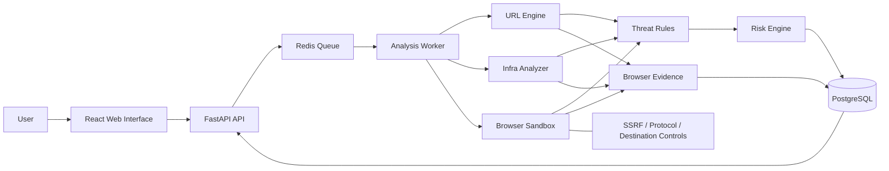

# OCULIS

---

## Why OCULIS?

A suspicious link creates a simple security problem:

**You need to inspect it, but inspecting it yourself may be the dangerous part.**

Opening an unknown URL directly can expose a browser, credentials, cookies, devices, and users to malicious content.

OCULIS changes that workflow.

Instead of:

```text
Unknown URL
     ↓
User opens it
     ↓
Browser contacts destination
     ↓
Risk is discovered too late

```

OCULIS follows:

```text
Unknown URL
     ↓
OCULIS receives the URL
     ↓
Safety checks + SSRF protection
     ↓
Remote isolated inspection
     ↓
DNS / TLS / HTTP / redirects
     ↓
Sandboxed browser rendering
     ↓
DOM + forms + scripts + network activity
     ↓
Evidence + risk analysis
     ↓
User sees the result

```

The user doesn't have to make the first risky visit themselves.

---

## The Core Idea

### Inspect first. Expose yourself later — or don't.

OCULIS is built around a distinctive user experience:

> **Enter a URL and see the remote-rendered evidence of what that destination was going to serve or load before you navigate to it yourself.**

The platform surfaces artifacts such as:

* Rendered page screenshots
* Redirect chains
* HTTP response metadata
* Security headers
* DNS resolution
* TLS certificate basics
* Forms and password fields
* External scripts
* Iframes
* Observed network requests
* Blocked requests
* Suspicious URL structures
* Lookalike / homoglyph indicators
* Evidence-backed security findings
* Explainable risk score and verdict

Rather than reducing everything to a black-box **"Safe / Dangerous"** label, OCULIS shows **why** a destination received a particular assessment.

---

## What Makes OCULIS Different?

Most URL scanners answer a question like:

> "Is this URL malicious?"

OCULIS is designed to answer a richer question:

> **"What happens when this URL is inspected, what does it attempt to expose or load, and what evidence suggests that I should or should not trust it?"**

That difference matters.

* A URL can use HTTPS and still be suspicious.
* A domain can contain a legitimate brand name and still be a lookalike.
* A page can look harmless while loading external scripts or requesting suspicious resources.

OCULIS therefore treats a verdict as an **explainable conclusion derived from multiple observable signals**, not as an unexplained binary decision.

---

## Key Capabilities

### Remote URL Inspection

Submit a URL without directly opening the target in your normal browsing session. OCULIS performs the inspection on its own infrastructure and returns the collected evidence.

### SSRF-Aware Fetching

The analysis pipeline validates destinations before network access and re-validates destinations across redirects. The intent is to prevent user-controlled URLs from being used to reach:

* `127.0.0.1` / `localhost`
* Private network ranges
* Link-local addresses
* Cloud metadata endpoints
* Restricted internal destinations

### Remote Browser Rendering

OCULIS can render a destination inside a sandboxed browser environment and capture:

* Full page screenshots
* DOM structure
* Form elements and password inputs
* Script tags and external iframes
* Console errors
* Outbound network requests

### Redirect Intelligence

Instead of examining only the submitted URL:

$$\text{Target A} \longrightarrow \text{Redirect B} \longrightarrow \text{Final Destination C}$$

OCULIS follows the chain inside its controlled analysis environment and records every hop toward the final destination.

### Infrastructure Inspection

Combines DNS information, TLS certificate basics, HTTP status, response headers, security headers, and redirect behavior into a unified inspection pass.

### Explainable Risk Engine

Produces a score from **0–100** and a verdict category backed by findings. Each finding includes severity, confidence, evidence, category, and audit reasoning.

---

## What the User Actually Sees

The OCULIS experience is built around evidence presentation.

### Before Inspection

```text
┌─────────────────────────────────────────────────────────────┐
│ TARGET URL                                                  │
│                                                             │
│  › https://suspicious-example.com/login                     │
│                                                 INSPECT URL │
└─────────────────────────────────────────────────────────────┘

```

### During Inspection

```text
REMOTE INSPECTION

✓ URL validation
✓ Infrastructure analysis
✓ Redirect tracing
● Browser sandbox
○ Evidence correlation
○ Risk calculation

```

### After Inspection

```text
RISK SCORE: 72 / 100 [ HIGH RISK ]

[ Redirect Chain ]
[ Browser Evidence ]
[ Network Requests ]
[ Infrastructure ]
[ Findings ]
[ Why OCULIS reached this verdict ]

```

---

## High-Value Use Cases

* **Phishing Investigation:** Inspect received suspension/verification links safely before credential entry.
* **SOC / Analyst Triage:** Perform a controlled first-pass inspection on URLs from ticketing systems, chat messages, or threat alerts.
* **Incident Response:** Snapshot observable remote behavior during active incidents without exposing local browser infrastructure.
* **Threat Research:** Analyze malicious landing pages, redirect networks, and lookalike domains.
* **Security Awareness:** Demonstrate visually how URLs redirect, trigger external requests, and capture credentials.

---

## Security Architecture



```text
                         ┌──────────────────┐
                         │       USER       │
                         └────────┬─────────┘
                                  │
                                  ▼
                         ┌──────────────────┐
                         │    OCULIS WEB    │
                         │ React + TypeScript│
                         └────────┬─────────┘
                                  │
                                  ▼
                         ┌──────────────────┐
                         │     FASTAPI      │
                         │       API        │
                         └────────┬─────────┘
                                  │
                                  ▼
                         ┌──────────────────┐
                         │   REDIS / RQ     │
                         │    JOB QUEUE     │
                         └────────┬─────────┘
                                  │
                         ┌────────▼─────────┐
                         │ ANALYSIS WORKER  │
                         └───┬────┬────┬────┘
                             │    │    │
               ┌─────────────┘    │    └─────────────┐
               ▼                  ▼                  ▼
         ┌──────────┐      ┌────────────┐      ┌─────────────┐
         │URL ENGINE│      │INFRA       │      │BROWSER      │
         │          │      │ANALYZER    │      │SANDBOX      │
         └────┬─────┘      └─────┬──────┘      └──────┬──────┘
              │                  │                    │
              └──────────────────┼────────────────────┘
                                 ▼
                       ┌────────────────────┐
                       │ THREAT RULE ENGINE │
                       └─────────┬──────────┘
                                 ▼
                       ┌────────────────────┐
                       │    RISK ENGINE     │
                       └─────────┬──────────┘
                                 ▼
                       ┌────────────────────┐
                       │    POSTGRESQL      │
                       └────────────────────┘

```

---

## Technology Stack

* **Frontend:** React, TypeScript, Vite, React Router, TanStack Query
* **Backend:** Python, FastAPI, Pydantic, SQLAlchemy, Alembic, HTTPX, dnspython, cryptography
* **Browser Sandbox:** Playwright, Chromium, Containerized Sandbox
* **Infrastructure:** Docker, Docker Compose, PostgreSQL, Redis, RQ
* **Quality & Testing:** pytest, ESLint, Oxlint, GitHub Actions

---

## Repository Structure

```text
OCULIS/
└── oculis/
    ├── SETUP_AND_TESTING.md
    ├── docker-compose.yml
    │
    ├── apps/
    │   ├── api/
    │   ├── sandbox/
    │   └── web/
    │
    └── docs/
        ├── OCULIS_FIXES_IMPLEMENTED.md
        └── oculis-refined-spec.md

```

For implementation details, setup instructions, and development workflow, refer to **`oculis/SETUP_AND_TESTING.md`**.

---

## Engineering Principles

1. **Inspect before exposing:** The first interaction with a suspicious destination should never require a local browser session.
2. **Evidence over black-box answers:** Security verdicts must be human-auditable and explainable.
3. **Isolation before functionality:** The pipeline fetching attacker-controlled content must be hardened first.
4. **HTTPS is not trust:** Transport encryption is one signal, not a guarantee of safety.
5. **Confidence is not certainty:** OCULIS provides analytical evidence rather than claiming omniscient threat classification.

---

## Current Scope & Roadmap

### Current Scope

* URL normalization & structural heuristics
* Homoglyph and lookalike detection
* SSRF-hardened network fetching
* Redirect chain tracing & DNS/TLS inspection
* Sandboxed DOM, screenshot, and request capture
* Rule-backed risk scoring dashboard

### Roadmap

* [ ] IOC extraction and export
* [ ] PDF security report generation
* [ ] Network relationship graphing
* [ ] Threat intelligence feed integrations
* [ ] Multi-tenant organization support & API key management
* [ ] Browser extension and SIEM integrations

---

## Developer

**Saim Iftikhar** — *Cybersecurity Engineer & Developer*

* **Portfolio:** [saim-portfolio.lovable.app](https://www.google.com/search?q=https://saim-portfolio.lovable.app)
* **LinkedIn:** [linkedin.com/in/saim-iftikhar-85aa90378](https://www.google.com/search?q=https://www.linkedin.com/in/saim-iftikhar-85aa90378)

---

## Responsible Use & Status

OCULIS is intended for legitimate security analysis, defensive research, education, and authorized testing. Users are responsible for ensuring inspections comply with local authorization requirements.

**Status:** OCULIS is an actively developed security engineering project and portfolio-grade research platform.


